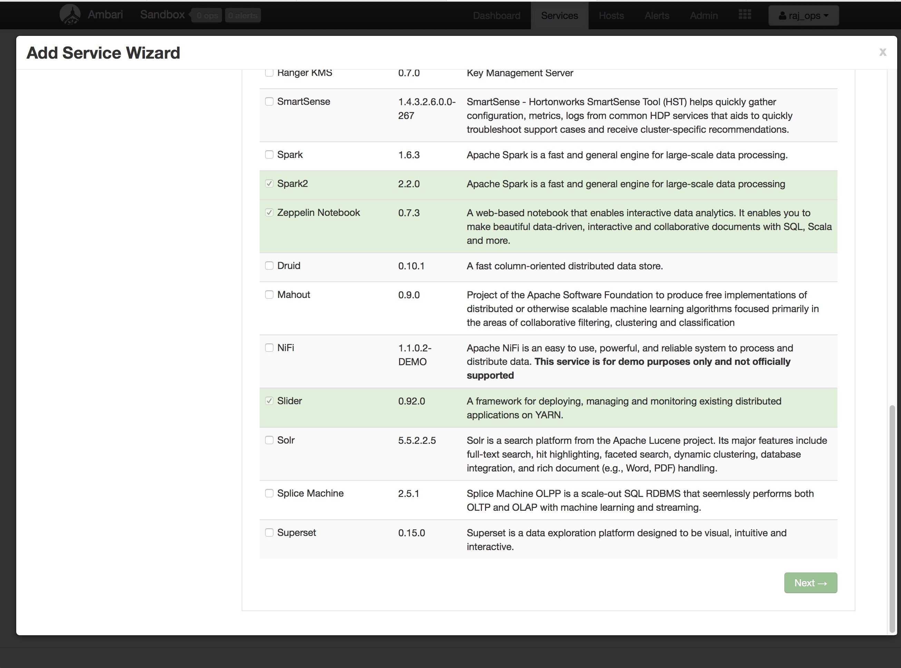
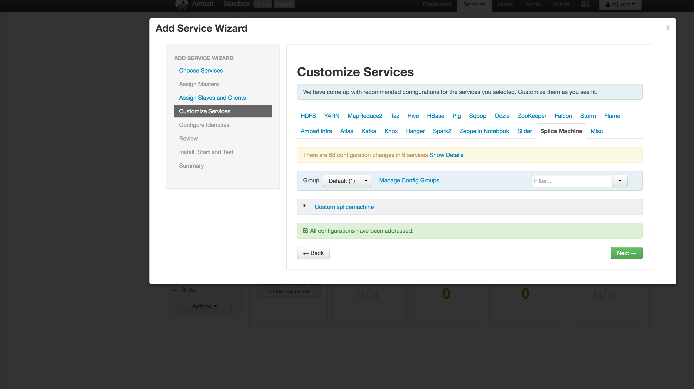
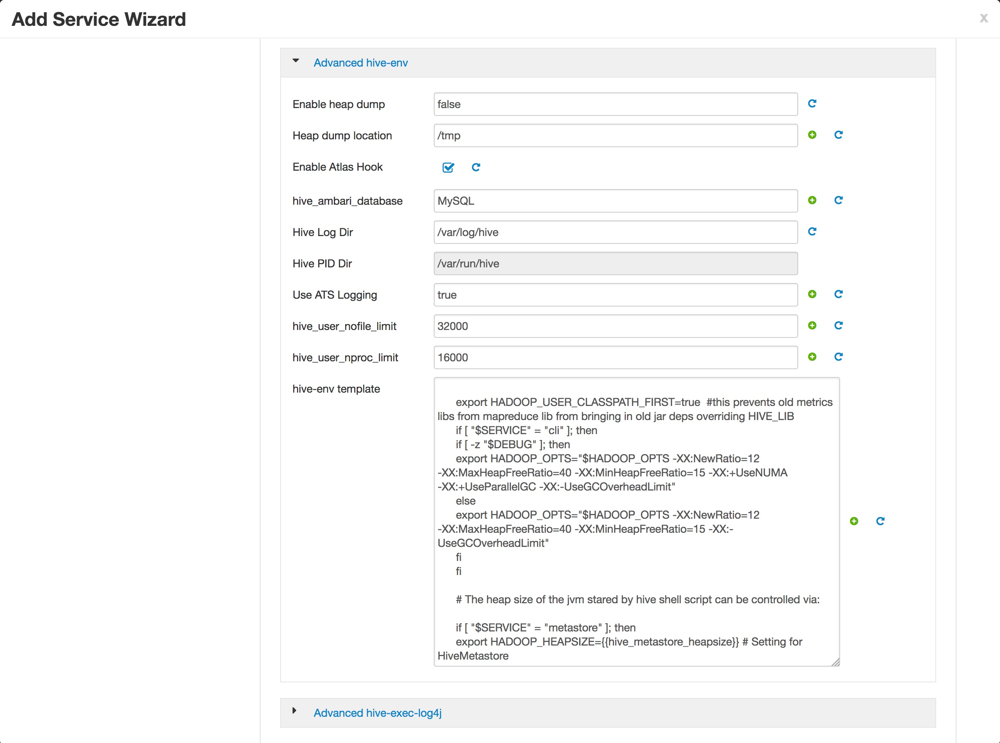
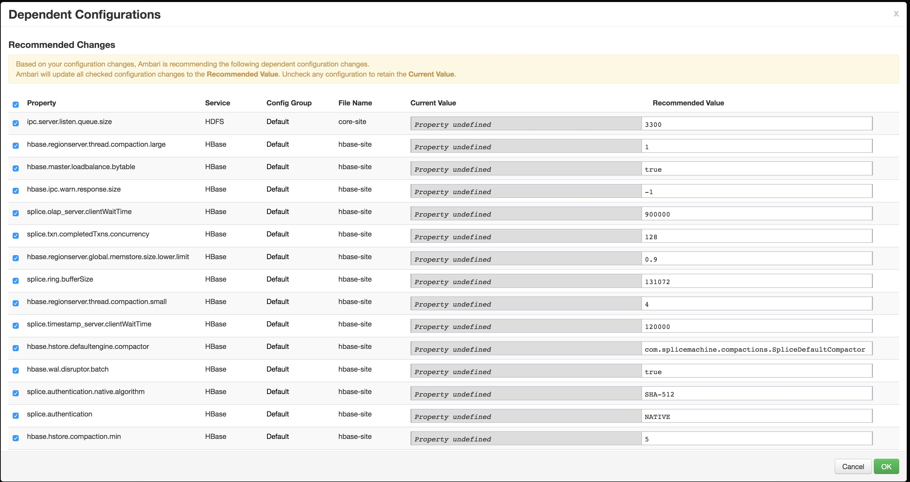

# splice-ambari-service
An Apache Ambari Service For Splice Machine

This is based on the creation of a custom service outlined here. 

https://cwiki.apache.org/confluence/display/AMBARI/Defining+a+Custom+Service

Existing Example Services can be located here.  

https://github.com/apache/ambari/tree/trunk/ambari-server/src/main/resources/common-services

#### Steps to deploy to HDP Virtual Machine.

1) Download HDP Sandbox for VirtualBox. https://hortonworks.com/tutorial/sandbox-deployment-and-install-guide/section/1/

2) Start Virtual Machine.

3) Log into virtual machine.

```
ssh root@127.0.0.1 -p2222
initial password hadoop
```

4) Make sure you have FPM installed properly for your environment.

http://fpm.readthedocs.io/en/latest/

5) Get latest ambari service branch to generate the RPM and restart Ambari Server.

```
git clone git@github.com:splicemachine/splice-ambari-service.git
cd splice-ambari-service
./build.sh
rpm -Uvh target/SOME_RPM_FILE_WITH_NO_ARCH
ambari-server restart 
```

6) Access the Ambari server UI.

```
http://127.0.0.1:8080/#/main/dashboard/metrics
```
7) Follow the steps to install a servive.

1.click the action button on the right buttom of the ambari page,then click on 'Add Services'


2.choose splice machine from the 'add service wizard'



3.choose hosts needed to install splice machine,please only choose hosts that have hbase region server installed.Then click next.


4.On the page of custom services,several properties need to customize by hand.
 


click 'yarn' tab then click 'advanced' tab,find advanced yarn-site then find 'yarn.application.classpath',click the button on the end of the line ( looks like 'refresh' button),so the value needed by splice machine can be set.


click 'hive' tab then click 'advanced' tab,find 
'advanced hive-env' then find 'hive-env template',click the button on the end of the line ( looks like 'refresh' button),so the value needed by splice machine can be set.



these are the only two needed to click by hand,other configurations needed by splicemachine is handled by ambari.

5.please review all the configuration change made by ambari and click OK to continue.



6.please click next all the way down to this page ,then click 'deploy',after that finishes,splice machine is installed.


7.restart all the services affected to start splice machine!


