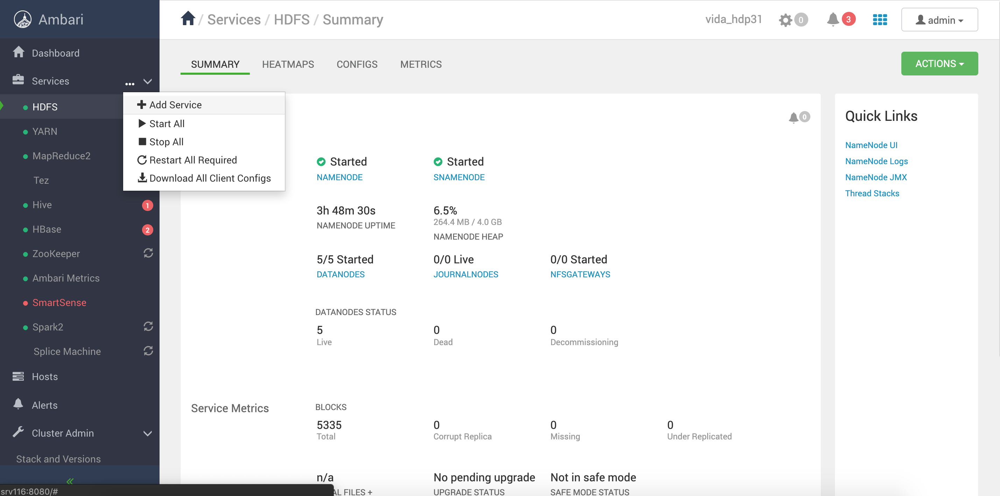
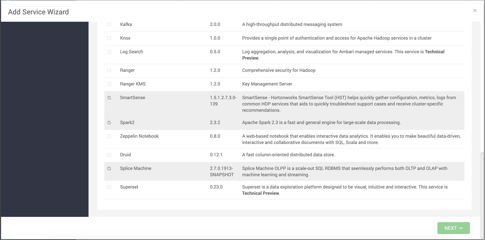
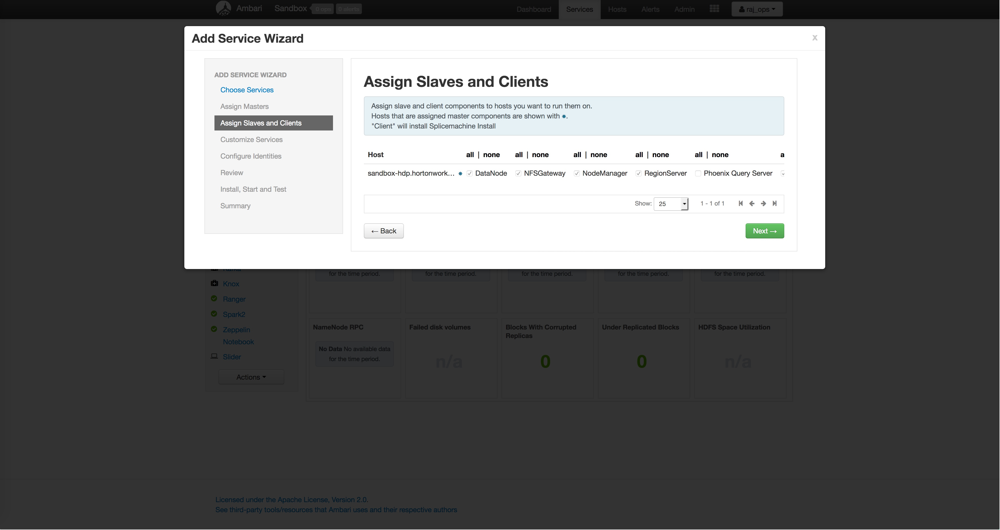
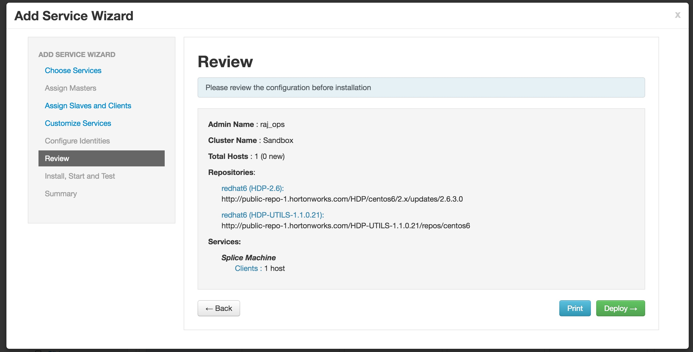

# Installing and Configuring Splice Machine for Hortonworks HDP

This topic describes installing and configuring Splice Machine on a
Hortonworks Ambari-managed cluster. Follow these steps:

1. [Verify Prerequisites](#verify-prerequisites)
2. [Download and Install Splice Machine](#download-and-install-splice-machine)
3. [Stop Hadoop Services](#stop-hadoop-services)
4. [Configure Hadoop Services](#configure-hadoop-services)
5. [Start Any Additional Services](#start-any-additional-services)
6. [Verifiy Configuration](#verify-configuration-modifications)
7. [Verify your Splice Machine Installation](#verify-your-splice-machine-installation)

## Verify Prerequisites

Before starting your Splice Machine installation, please make sure that
your cluster contains the prerequisite software components:

* A cluster running HDP 3.1
* Ambari installed and configured for HDP
* HBase 2.0 installed
* HDFS installed
* YARN installed
* ZooKeeper installed
* Spark 2 installed
* Kafka installed
* Ensure that Phoenix services are **NOT** installed on your cluster, as
  they interfere with Splice Machine HBase settings.

**NOTE:** The specific versions of these components that you need depend on your
operating environment, and are called out in detail in the
[Requirements](https://doc.splicemachine.com/onprem_info_requirements.html) topic of our *Getting Started Guide*.

## Install the RPMs

* Download the ambari_service rpms onto your ambari_server node

`scp splicemachine_ambari_service-hdp3.1.0.2.7.0.1913-SNAPSHOT.p0.300_1.noarch.rpm username@to_host:/remote/directory/`

* Install the ambari_service rpm

`sudo rpm -ivh splicemachine_ambari_service-hdp3.1.0.2.7.0.1913-SNAPSHOT.p0.300_1.noarch.rpm`

* Go into each node and download the splicemachine rpm into each node

`sudo rpm -ivh splicemachine-hdp3.1.0.2.7.0.1913-SNAPSHOT.p0.300_1.noarch.rpm`

* After installing the rpms, restart ambari-server

`service ambari-server restart`.

## Install splicemachine using Ambari service

Follow the steps to install splicemachine server.

1. Click the action button on the top left of the ambari page,then click on 'Add Services'



2. Choose splice machine from the 'add service wizard'



3. Choose hosts needed to install splice machine. Choose both HBase master and HBase region servers. Then click next.



4. Please review all the configuration changes made by Ambari and click OK to continue.

## Verify Configuration Modifications

### HDFS Configuartion

(1) Make sure these settings are set

| NameNode Property                     | Value     |
|-------------------------------------- |---------  |
| NameNode Java heap size               | 4096 MB   |
| NameNode new generation size          | 512 MB    |
| NameNode maximum new generation size  | 512 MB    |

(2)

| DataNode Property                 | Value     |
|---------------------------------  |---------  |
| DataNode maximum Java heap size   | 2048 MB   |

(3)

| Advanced ssl-client Property  | Value   |
|------------------------------ |-------  |
| ssl.client.keystore.location  | admin   |

(4)

| Custom core-site Property     | Value   |
|------------------------------ |-------  |
| ipc.server.listen.queue.size  | 3300    |

(5)

| Custom hdfs-site Property                                  | Value   |
|----------------------------------------------------------- |-------  |
| dfs.datanode.handler.count                                 | 20      |
| dfs.client.block.write.retries                             | 6       |
| dfs.client.block.write.locateFollowingBlock.retries        | 10      |
| dfs.client.block.write.replace-datanode-on-failure.policy  | ALWAYS  |
| dfs.namenode.replication.min                               | 2       |

### YARN Configuration

(1)

| Memory Property                                     | Value     |
|---------------------------------------------------- |---------- |
| Memory allocated for all YARN containers on a node  | 30720 MB  |
| Maximum Container Size (Memory)                     | 30720 MB  |

### MapReduce2 Configuration

(1)

| MapReduce Property  | Value     |
|-------------------- |---------- |
| Map Memory          | 8192 MB   |
| Reduce Memory       | 16384 MB  |
| AppMaster Memory    | 8192 MB   |

### Zookeeper Configuration

(1)

| Custom zoo.cfg Property   | Value   |
|-------------------------  |-------- |
| maxClientCnxns            | 0       |
| maxSessionTimeout         | 120000  |

### Hbase Configuration

**Note**: Ambari will not show all the recommended values in some situations. Make sure these 
important configurations are set properly by clicking "recommend" button next to the configs:

(1) 

| Server Property                               | Value     |
|---------------------------------------------  |---------- |
| HBase Master Maximum Memory                   | 5120 MB   |
| HBase RegionServer Maximum Memory             | 24576 MB  |
| % of RegionServer Allocated to Read Buffers   | 0.25      |
| Number of Handlers per RegionServer           | 200       |

(2)

| Timeouts Property                             | Value                 |
|---------------------------------------------  |---------------------  |
| Zookeeper Session Timeout                     | 120000 milliseconds   |
| HBase RPC Timeout                             | 120000 milliseconds   |

(3)

| General Property                                | Value       |
|------------------------------------------------ |-----------  |
| Maximum Store Files before Minor Compaction     | 5           |
| Number of Fetched Rows when Scanning from Disk  | 1000 rows   |

(4)
Note:
* hbase.bucketcache.ioengine should be empty
* hbase.zookeeper.quorum make sure the correct hosts are set in the value

| Advanced hbase-site Property            | Value                                                                                                                                                                                                                                                                                                                                                                                                                                       |
|---------------------------------------- |-------------------------------------------------------------------------------------------------------------------------------------------------------------------------------------------------------------------------------------------------------------------------------------------------------------------------------------------------------------------------------------------------------------------------------------------  |
| hbase.bucketcache.ioengine              |                                                                                                                                                                                                                                                                                                                                                                                                                                             |
| hbase.coprocessor.master.classes        | hbase.coprocessor.master.classes                                                                                                                                                                                                                                                                                                                                                                                                            |
| hbase.coprocessor.region.classes        | org.apache.hadoop.hbase.security.access.SecureBulkLoadEndpoint, com.splicemachine.hbase.MemstoreAwareObserver, com.splicemachine.derby.hbase.SpliceIndexObserver, com.splicemachine.derby.hbase.SpliceIndexEndpoint, com.splicemachine.hbase.RegionSizeEndpoint, com.splicemachine.si.data.hbase.coprocessor.TxnLifecycleEndpoint, com.splicemachine.si.data.hbase.coprocessor.SIObserver, com.splicemachine.hbase.BackupEndpointObserver   |
| hbase.coprocessor.regionserver.classes  | com.splicemachine.hbase.RegionServerLifecycleObserver,com.splicemachine.si.data.hbase.coprocessor.SpliceRSRpcServices                                                                                                                                                                                                                                                                                                                                                                                       |
| hbase.zookeeper.quorum                  | [a comma delimited list of zookeeper servers]                                                                                                                                                                                                                                                                                                                                                                                                                           |

(5)

| Custom hbase-site Property                            | Value                                                                                                     |
|-----------------------------------------------------  |---------------------------------------------------------------------------------------------------------- |
| hbase.balancer.period                                 | 60000                                                                                                     |
| hbase.client.ipc.pool.size                            | 10                                                                                                        |
| hbase.client.max.perregion.tasks                      | 100                                                                                                       |
| hbase.hstore.compaction.min.size                      | 136314880                                                                                                 |
| hbase.hstore.defaultengine.compactionpolicy.class     | com.splicemachine.compactions.SpliceDefaultCompactionPolicy                                               |
| hbase.hstore.defaultengine.compactor.class            | com.splicemachine.compactions.SpliceDefaultCompactor                                                      |
| hbase.htable.threads.max                              | 96                                                                                                        |
| hbase.ipc.warn.response.size                          | -1                                                                                                        |
| hbase.ipc.warn.response.time                          | -1                                                                                                        |
| hbase.master.balancer.stochastic.regionCountCost      | 1500                                                                                                      |
| hbase.master.hfilecleaner.plugins                     | com.splicemachine.hbase.SpliceHFileCleaner,org.apache.hadoop.hbase.master.cleaner.TimeToLiveHFileCleaner  |
| hbase.mvcc.impl                                       | org.apache.hadoop.hbase.regionserver.SIMultiVersionConsistencyControl                                     |
| hbase.regions.slop                                    | 0                                                                                                         |
| hbase.regionserver.global.memstore.size.lower.limit   | 0.9                                                                                                       |
| hbase.regionserver.lease.period                       | 1200000                                                                                                   |
| hbase.regionserver.maxlogs                            | 48                                                                                                        |
| hbase.regionserver.metahandler.count                  | 200                                                                                                       |
| hbase.regionserver.thread.compaction.large            | 4                                                                                                         |
| hbase.regionserver.wal.enablecompression              | true                                                                                                      |
| hbase.rowlock.wait.duration                           | 10                                                                                                        |
| hbase.splitlog.manager.timeout                        | 3000                                                                                                      |
| hbase.status.multicast.port                           | 16100                                                                                                     |
| hbase.wal.disruptor.batch                             | true                                                                                                      |
| hbase.wal.provider                                    | multiwal                                                                                                  |
| hbase.wal.regiongrouping.numgroups                    | 16                                                                                                        |
| hbase.zookeeper.property.tickTime                     | 6000                                                                                                      |
| hfile.block.bloom.cacheonwrite                        | true                                                                                                      |
| io.storefile.bloom.error.rate                         | 0.0005                                                                                                    |
| splice.authentication                                 | NATIVE                                                                                                    |
| splice.authentication.native.algorithm                | SHA-512                                                                                                   |
| splice.client.numConnections                          | 1                                                                                                         |
| splice.client.write.maxDependentWrites                | 60000                                                                                                     |
| splice.client.write.maxIndependentWrites              | 60000                                                                                                     |
| splice.compression                                    | snappy                                                                                                    |
| splice.kafka.bootstrapServers                         | < Hostname of Kafka server in this environment >:9092                                                       |
| splice.marshal.kryoPoolSize                           | 1100                                                                                                      |
| splice.olap_server.clientWaitTime                     | 900000                                                                                                    |
| splice.ring.bufferSize                                | 131072                                                                                                    |
| splice.splitBlockSize                                 | 67108864                                                                                                  |
| splice.timestamp_server.clientWaitTime                | 120000                                                                                                    |
| splice.txn.activeTxns.cacheSize                       | 10240                                                                                                     |
| splice.txn.completedTxns.concurrency                  | 128                                                                                                       |
| splice.txn.concurrencyLevel                           | 4096                                                                                                      |

(6) In Hbase's config "hbase-env template" under advanced hbase-env, make sure the comments like "Splice Specific 
Information" are in the configurations. i.e.

```
# Set environment variables here.

# The java implementation to use. Java 1.6 required.
export JAVA_HOME={{java64_home}}

# HBase Configuration directory
export HBASE_CONF_DIR=${HBASE_CONF_DIR:-{{hbase_conf_dir}}}

# Extra Java CLASSPATH elements. Optional.
export HBASE_CLASSPATH=${HBASE_CLASSPATH}


# The maximum amount of heap to use, in MB. Default is 1000.
# export HBASE_HEAPSIZE=1000

# Extra Java runtime options.
# Below are what we set by default. May only work with SUN JVM.
# For more on why as well as other possible settings,
# see http://wiki.apache.org/hadoop/PerformanceTuning
export SERVER_GC_OPTS="-verbose:gc -XX:-PrintGCCause -XX:+PrintAdaptiveSizePolicy -XX:+PrintGCDetails -XX:+PrintGCDateStamps -Xloggc:{{log_dir}}/gc.log-`date +'%Y%m%d%H%M'`"
# Uncomment below to enable java garbage collection logging.
# export HBASE_OPTS="$HBASE_OPTS -verbose:gc -XX:+PrintGCDetails -XX:+PrintGCDateStamps -Xloggc:$HBASE_HOME/logs/gc-hbase.log"

# Uncomment and adjust to enable JMX exporting
# See jmxremote.password and jmxremote.access in $JRE_HOME/lib/management to configure remote password access.
# More details at: http://java.sun.com/javase/6/docs/technotes/guides/management/agent.html
#
# export HBASE_JMX_BASE="-Dcom.sun.management.jmxremote.ssl=false -Dcom.sun.management.jmxremote.authenticate=false"
# If you want to configure BucketCache, specify '-XX: MaxDirectMemorySize=' with proper direct memory size
# export HBASE_THRIFT_OPTS="$HBASE_JMX_BASE -Dcom.sun.management.jmxremote.port=10103"
# export HBASE_ZOOKEEPER_OPTS="$HBASE_JMX_BASE -Dcom.sun.management.jmxremote.port=10104"

# File naming hosts on which HRegionServers will run. $HBASE_HOME/conf/regionservers by default.
export HBASE_REGIONSERVERS=${HBASE_CONF_DIR}/regionservers

# Extra ssh options. Empty by default.
# export HBASE_SSH_OPTS="-o ConnectTimeout=1 -o SendEnv=HBASE_CONF_DIR"

# Where log files are stored. $HBASE_HOME/logs by default.
export HBASE_LOG_DIR={{log_dir}}

# A string representing this instance of hbase. $USER by default.
# export HBASE_IDENT_STRING=$USER

# The scheduling priority for daemon processes. See 'man nice'.
# export HBASE_NICENESS=10

# The directory where pid files are stored. /tmp by default.
export HBASE_PID_DIR={{pid_dir}}

# Seconds to sleep between slave commands. Unset by default. This
# can be useful in large clusters, where, e.g., slave rsyncs can
# otherwise arrive faster than the master can service them.
# export HBASE_SLAVE_SLEEP=0.1

# Tell HBase whether it should manage it's own instance of Zookeeper or not.
export HBASE_MANAGES_ZK=false


JDK_DEPENDED_OPTS="-XX:PermSize=128m -XX:MaxPermSize=128m -XX:ReservedCodeCacheSize=256m"


# Set common JVM configuration
export HBASE_OPTS="$HBASE_OPTS -XX:+UseG1GC -XX:MaxGCPauseMillis=100 -XX:-ResizePLAB -XX:ErrorFile={{log_dir}}/hs_err_pid%p.log -Djava.io.tmpdir={{java_io_tmpdir}}"
export HBASE_MASTER_OPTS="$HBASE_MASTER_OPTS -Xmx{{master_heapsize}} -XX:ParallelGCThreads={{parallel_gc_threads}} $JDK_DEPENDED_OPTS "
export HBASE_REGIONSERVER_OPTS="$HBASE_REGIONSERVER_OPTS -Xms{{regionserver_heapsize}} -Xmx{{regionserver_heapsize}} -XX:ParallelGCThreads={{parallel_gc_threads}} $JDK_DEPENDED_OPTS"
export PHOENIX_QUERYSERVER_OPTS="$PHOENIX_QUERYSERVER_OPTS -XX:ParallelGCThreads={{parallel_gc_threads}} $JDK_DEPENDED_OPTS"

# Add Kerberos authentication-related configuration

export HBASE_OPTS="$HBASE_OPTS -Djava.security.auth.login.config={{client_jaas_config_file}} {{zk_security_opts}}"
export HBASE_MASTER_OPTS="$HBASE_MASTER_OPTS -Djava.security.auth.login.config={{master_jaas_config_file}} -Djavax.security.auth.useSubjectCredsOnly=false"
export HBASE_REGIONSERVER_OPTS="$HBASE_REGIONSERVER_OPTS -Djava.security.auth.login.config={{regionserver_jaas_config_file}} -Djavax.security.auth.useSubjectCredsOnly=false"
export PHOENIX_QUERYSERVER_OPTS="$PHOENIX_QUERYSERVER_OPTS -Djava.security.auth.login.config={{queryserver_jaas_config_file}}"


# HBase off-heap MaxDirectMemorySize
export HBASE_REGIONSERVER_OPTS="$HBASE_REGIONSERVER_OPTS  -XX:MaxDirectMemorySize={{hbase_max_direct_memory_size}}m "
export HBASE_MASTER_OPTS="$HBASE_MASTER_OPTS  -XX:MaxDirectMemorySize={{hbase_max_direct_memory_size}}m "

#Add Splice Jars to HBASE_PREFIX_CLASSPATH
 if [ ! "$1" = "shell" ]; then
 export HBASE_CLASSPATH_PREFIX=/var/lib/splicemachine/*:/usr/hdp/3.1.0.0-78/spark2/jars/*:/usr/hdp/3.1.0.0-78/phoenix/lib/phoenix-core-5.0.0.3.1.0.0-78.jar
 fi
#Add Splice Specific Information to HBase Master
 export HBASE_MASTER_OPTS="${HBASE_MASTER_OPTS} -Dsplice.spark.enabled=true -Dsplice.spark.app.name=SpliceMachine -Dsplice.spark.master=yarn -Dsplice.spark.submit.deployMode=client -Dsplice.spark.logConf=true -Dsplice.spark.yarn.maxAppAttempts=1 -Dsplice.spark.driver.maxResultSize=1g -Dsplice.spark.driver.cores=2 -Dsplice.spark.yarn.am.memory=1g -Dsplice.spark.dynamicAllocation.enabled=true -Dsplice.spark.dynamicAllocation.executorIdleTimeout=120 -Dsplice.spark.dynamicAllocation.cachedExecutorIdleTimeout=120 -Dsplice.spark.dynamicAllocation.minExecutors=0 -Dsplice.spark.kryo.referenceTracking=false -Dsplice.spark.kryo.registrator=com.splicemachine.derby.impl.SpliceSparkKryoRegistrator -Dsplice.spark.kryoserializer.buffer.max=512m -Dsplice.spark.kryoserializer.buffer=4m -Dsplice.spark.locality.wait=100 -Dsplice.spark.memory.fraction=0.5 -Dsplice.spark.scheduler.mode=FAIR -Dsplice.spark.serializer=org.apache.spark.serializer.KryoSerializer -Dsplice.spark.shuffle.compress=false -Dsplice.spark.shuffle.file.buffer=128k -Dsplice.spark.shuffle.service.enabled=true -Dsplice.spark.reducer.maxReqSizeShuffleToMem=134217728 -Dsplice.spark.yarn.am.extraLibraryPath=/usr/hdp/current/hadoop-client/lib/native -Dsplice.spark.yarn.am.waitTime=10s -Dsplice.spark.yarn.executor.memoryOverhead=2048 -Dsplice.spark.yarn.am.extraJavaOptions=-Dhdp.version=3.1.0.0-78 -Dsplice.spark.driver.extraJavaOptions=-Dhdp.version=3.1.0.0-78 -Dsplice.spark.driver.extraLibraryPath=/usr/hdp/current/hadoop-client/lib/native -Dsplice.spark.driver.extraClassPath=/usr/hdp/current/hbase-regionserver/conf:/usr/hdp/current/hbase-regionserver/lib/htrace-core-3.1.0-incubating.jar -Dsplice.spark.ui.retainedJobs=100 -Dsplice.spark.ui.retainedStages=100 -Dsplice.spark.worker.ui.retainedExecutors=100 -Dsplice.spark.worker.ui.retainedDrivers=100 -Dsplice.spark.streaming.ui.retainedBatches=100 -Dsplice.spark.executor.cores=2 -Dsplice.spark.executor.memory=2g -Dspark.compaction.reserved.slots=4 -Dsplice.spark.eventLog.enabled=true -Dsplice.spark.eventLog.dir=hdfs:///user/splice/history -Dsplice.spark.local.dir=/tmp -Dsplice.spark.executor.userClassPathFirst=true -Dsplice.spark.driver.userClassPathFirst=true -Dsplice.spark.executor.extraJavaOptions=-Dhdp.version=3.1.0.0-78 -Dsplice.spark.executor.extraLibraryPath=/usr/hdp/current/hadoop-client/lib/native -Dsplice.spark.executor.extraClassPath=/usr/hdp/current/hbase-regionserver/conf:/usr/hdp/current/hbase-regionserver/lib/htrace-core-3.1.0-incubating.jar:/var/lib/splicemachine/*:/usr/hdp/3.1.0.0-78/spark2/jars/*:/usr/hdp/current/hbase-master/lib/*:/usr/hdp/3.1.0.0-78/kafka/libs/*:/usr/hdp/3.1.0.0-78/hadoop-mapreduce/* -Dsplice.spark.yarn.jars=/usr/hdp/3.1.0.0-78/spark2/jars/*"
#Add Splice Specific Information to Region Server
 export HBASE_REGIONSERVER_OPTS="${HBASE_REGIONSERVER_OPTS} -Dcom.sun.management.jmxremote.authenticate=false -Dcom.sun.management.jmxremote.ssl=false -Dcom.sun.management.jmxremote.port=10102" 
 ```

Check the location of your hdp version if not 3.1.0.0-78, update the locations the template.


6. Please click next all the way down to this page ,then click 'deploy'. After that finishes, Splice
 Machine is installed.



7. Restart all the services affected to start Splice Machine!

### Kafka Maintenance Installation

See the [splice_spark2 README](../../../splice_spark2/README.md) for instructions for setting up the Kafka Maintenance 
process in a bare metal installation.

## Start any Additional Services

We started this installation by shutting down your cluster services, and
then configured and restarted each individual service used by Splice
Machine.

If you had any additional services running, such as Ambari Metrics, you
need to restart each of those services.

If you are upgrading from versions before 1901, you need to follow these steps:

1. Delete Splice Ambari service on web UI.
2. Update RPM packages on each machine.
3. Restart Ambari server.
4. Re-install Splice Ambari service from web UI


## Verify your Splice Machine Installation

Now start using the Splice Machine command line interpreter, which is
referred to as `the splice prompt` or simply `splice&gt;` by launching the
`sqlshell.sh` script on any node in your cluster that is running an HBase region server.

The command line interpreter defaults to connecting on port `1527` on
`localhost`, with username `splice`, and password `admin`. You can
override these defaults when starting the interpreter, as described in
the [Command Line (splice&gt;) Reference](https://doc.splicemachine.com/cmdlineref_intro.html) topic
in our *Developer's Guide*.

Now try entering a few sample commands you can run to verify that
everything is working with your Splice Machine installation.

   <table>
    <col />
    <col />
    <thead>
        <tr>
            <th>Operation</th>
            <th>Command to perform operation</th>
        </tr>
    </thead>
    <tbody>
        <tr>
            <td>Display tables</td>
            <td><code>splice&gt; show tables;</code></td>
        </tr>
        <tr>
            <td>Create a table</td>
            <td><code>splice&gt; create table test (i int);</code></td>
        </tr>
        <tr>
            <td>Add data to the table</td>
            <td><code>splice&gt; insert into test values 1,2,3,4,5;</code></td>
        </tr>
        <tr>
            <td>Query data in the table</td>
            <td><code>splice&gt; select * from test;</code></td>
        </tr>
        <tr>
            <td>Drop the table</td>
            <td><code>splice&gt; drop table test;</code></td>
        </tr>
        <tr>
            <td>Exit the command line interpreter</td>
            <td><code>splice&gt; exit;</code></td>
        </tr>
        <tr>
            <td colspan="2"><strong>Make sure you end each command with a semicolon</strong> (<code>;</code>), followed by the <em>Enter</em> key or <em>Return</em> key </td>
        </tr>
    </tbody>
   </table>

See the [Command Line (splice&gt;)  Reference](https://doc.splicemachine.com/cmdlineref_intro.html)
section of our *Developer's Guide* for information about our commands
and command syntax.
