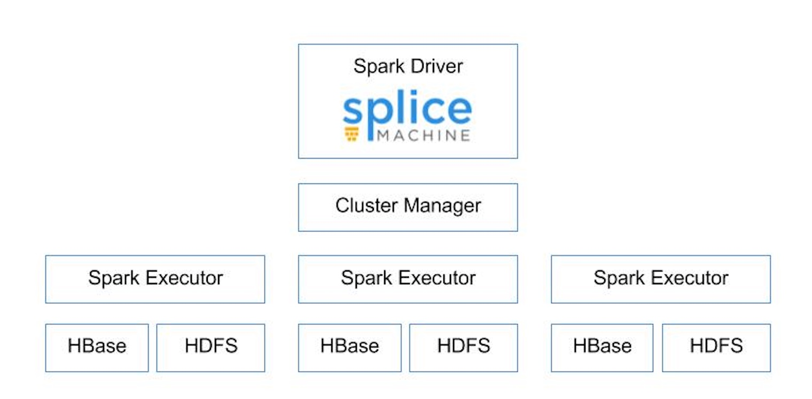

## Splice Machine's Spark Adapter.

### Splice Machine Spark Adapter Architecture

Splice Machine's Spark Adapter creates a transactionally correct, _transient_ Splice Machine node inside the Spark Driver application.  This allows Splice Machine to perform SQL operations as though it was executed via JDBC although it is being initialized through various spark client platforms (Scala, Python, etc).  This means Splice Machine parses, plans, and executes SQL and instructions inside the Spark Driver Application alongside existing spark instructions.

The desired architecture is illustrated below.




#### Splice Spark Adapter Implementation

The innovative piece of the implementation is creating a Splice Machine Node inside the Spark Driver.  This is peformed by this little snippet of code.

```scala
 
 @transient lazy val internalConnection = {
    SpliceSpark.setupSpliceStaticComponents();
    val engineDriver: EngineDriver = EngineDriver.driver
    loadDriver()
    assert(engineDriver != null, "Not booted yet!")
    // Create a static statement context to enable nested connections
    val maker: EmbedConnectionMaker = new EmbedConnectionMaker
    val dbProperties: Properties = new Properties;
    dbProperties.put("useSpark","true")
    maker.createNew(dbProperties);
    dbProperties.put(EmbedConnection.INTERNAL_CONNECTION, "true")
    SpliceClient.isClient = true
    maker.createNew(dbProperties)
  }

```

The node does **not** use dictionary caching and transactionally interacts with core HBase storage at initialization.  This makes the transient node **not** part of the dictionary cache mechanism.

Splice Machine can create a set of spark instructions from any SQL statement and that is heavily leaned upon for the Spark Adapter.  From this simple code in the adapter 

```scala
 
 def df(sql: String): Dataset[Row] = {
    SparkUtils.resultSetToDF(internalConnection.createStatement().executeQuery(sql));
  }

```

Splice Machine creates a dataframe from any SQL supplied.  Across the adapter, this core building block is utilized to implement a Spark DataSource and perform CRUD operations.

##### CRUD Operations

All CRUD operations **maintain** indexes, constraints, and triggers.  The Splice Machine write pipeline will be initialized on each Spark Executor and stream into HBase via the same mechanism as a file Bulk Import (Fast).   

All Crud operations are identified to the datasource via a property map that provides the table and JDBC url.

```scala

    val internalOptions = Map(
      JDBCOptions.JDBC_TABLE_NAME -> "tpch.customer",
      JDBCOptions.JDBC_URL -> "jdbc:splice://localhost:1527/splicedb;user=USERNAME;password=PASSWORD"
    )

```

You will need to import certain libraries that will include **splicemachine** as a possible data source inside your spark client code or Apache Zeppelin notebook.

```scala
%spark

import com.splicemachine.spark.splicemachine._

```

###### Insert Implementation

The insert implementation uses _Insert into_ clause to wrap a special SpliceDatasetVTI that corresponds to the underlying DataFrame.   

```scala
 
  def insert(dataFrame: DataFrame, schemaTableName: String): Unit = {
    SpliceDatasetVTI.datasetThreadLocal.set(dataFrame)
    val columnList = SpliceJDBCUtil.listColumns(dataFrame.schema.fieldNames)
    val schemaString = SpliceJDBCUtil.schemaWithoutNullableString(dataFrame.schema,url)
    val sqlText = s"insert into $schemaTableName  ($columnList) --splice-properties useSpark=true\n select $columnList from " +
      s"new com.splicemachine.derby.vti.SpliceDatasetVTI() as SpliceDatasetVTI ($schemaString)"
    internalConnection.createStatement().executeUpdate(sqlText)
  }

```

###### Update Implementation

The update implementation can update 1..N columns at a time as long as the underlying DataFrame provides the primary keys and the columns to update.  It currently does not 
work on tables without primary keys.  If you need to update them, then the SQL will have to be completely within Splice Machine.

```scala
 
  def update(dataFrame: DataFrame, schemaTableName: String): Unit = {
    val jdbcOptions = new JDBCOptions(Map(
      JDBCOptions.JDBC_URL -> url,
      JDBCOptions.JDBC_TABLE_NAME -> schemaTableName))
    SpliceDatasetVTI.datasetThreadLocal.set(dataFrame)
    val keys = SpliceJDBCUtil.retrievePrimaryKeys(jdbcOptions)
    val prunedFields = dataFrame.schema.fieldNames.filter((p: String) => keys.indexOf(p) == -1)
    val columnList = SpliceJDBCUtil.listColumns(prunedFields)
    val schemaString = SpliceJDBCUtil.schemaWithoutNullableString(dataFrame.schema,url)
    val sqlText = s"update $schemaTableName" + " " +
      s"set ($columnList) = (" +
      s"select $columnList from " +
      "new com.splicemachine.derby.vti.SpliceDatasetVTI() " +
      s"as SDVTI ($schemaString) where "
    val dialect = JdbcDialects.get(url)
    val whereClause = keys.map(x => schemaTableName+"."+dialect.quoteIdentifier(x) + " = SDVTI."++dialect.quoteIdentifier(x)).mkString(" AND ")
    val combinedText = sqlText+whereClause+")"
    internalConnection.createStatement().executeUpdate(combinedText)
  }

```

###### Delete Implementation

The delete implementation requires the underlying DataFrame to provide the primary keys of the table to delete.  It currently does not 
work on tables without primary keys.

```scala

   def delete(dataFrame: DataFrame, schemaTableName: String): Unit = {
     val jdbcOptions = new JDBCOptions(Map(
       JDBCOptions.JDBC_URL -> url,
       JDBCOptions.JDBC_TABLE_NAME -> schemaTableName))
     SpliceDatasetVTI.datasetThreadLocal.set(dataFrame)
     val keys = SpliceJDBCUtil.retrievePrimaryKeys(jdbcOptions)
     val columnList = SpliceJDBCUtil.listColumns(dataFrame.schema.fieldNames)
     val schemaString = SpliceJDBCUtil.schemaWithoutNullableString(dataFrame.schema,url)
     val sqlText = s"delete from $schemaTableName where exists (select 1 from " +
       "new com.splicemachine.derby.vti.SpliceDatasetVTI() " +
       s"as SDVTI ($schemaString) where "
     val dialect = JdbcDialects.get(url)
     val whereClause = keys.map(x => schemaTableName+"."+dialect.quoteIdentifier(x) + " = SDVTI."++dialect.quoteIdentifier(x)).mkString(" AND ")
     val combinedText = sqlText+whereClause+")"
     internalConnection.createStatement().executeUpdate(combinedText)
   }

```


###### Transactional CRUD 

Here is an example transactional test showing how any crud operation can either commit, rollback or be batched (savepoints) with other operations.

```scala

  test("rollback  insertion") {
    val conn : Connection = splicemachineContext.getConnection()
    conn.setAutoCommit(false);
    val df = sqlContext.read.options(internalOptions).splicemachine
    val changedDF = df.withColumn("C6_INT", when(col("C6_INT").leq(10), col("C6_INT").plus(10)) )
    splicemachineContext.insert(changedDF, internalTN)
    conn.rollback();
    val newDF = sqlContext.read.options(internalOptions).splicemachine
    conn.setAutoCommit(true);
    assert(newDF.count == 10)
  }

```

This allows ETL to move the database from one consistent state to the next consistent state.


